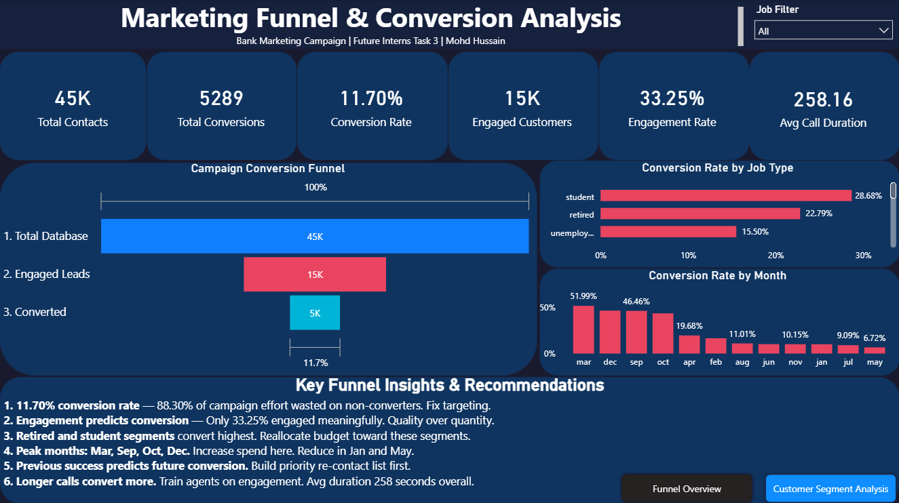
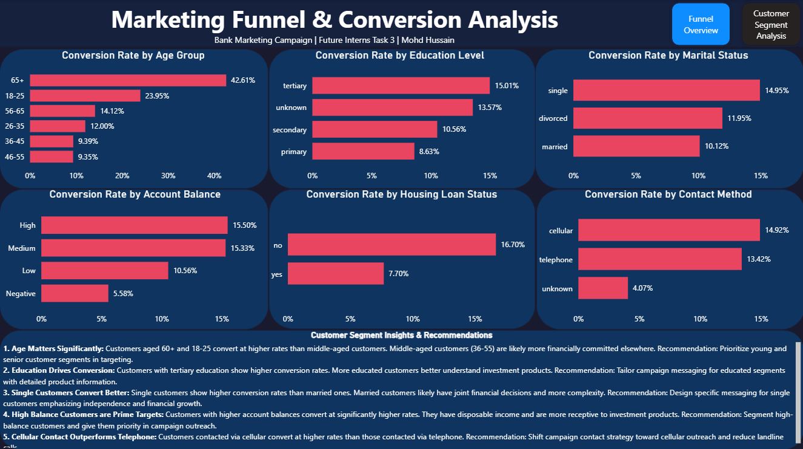

# Marketing Funnel & Conversion Performance Analysis
### Future Interns - Data Science & Analytics Internship | Task 3
**Intern:** Mohd Hussain | **CIN:** FIT/APR26/DS16442 | **Duration:** April 2026 – May 2026

---

## 📌 Project Overview
This project analyzes a real-world bank marketing campaign dataset to understand how customers move through the conversion funnel, identify drop-off points, and provide actionable recommendations to improve campaign conversion rates.

---

## 🎯 Business Questions Answered
- What is the overall conversion rate of the campaign?
- Where are customers dropping off in the funnel?
- Which customer segments convert at the highest rates?
- Which months show peak conversion performance?
- Which job types and demographics respond best to campaigns?
- How does call engagement affect conversion?

---

## 📊 Dashboard Pages

### Page 1 — Funnel Overview
- 6 KPI Cards: Total Contacts, Total Conversions, Conversion Rate, Engaged Leads, Engagement Rate, Avg Call Duration
- Campaign Conversion Funnel (3-stage funnel visual)
- Conversion Rate by Job Type
- Conversion Rate by Month
- Key Funnel Insights & Recommendations

### Page 2 — Customer Segment Analysis
- Conversion Rate by Age Group
- Conversion Rate by Education Level
- Conversion Rate by Marital Status
- Conversion Rate by Account Balance
- Conversion Rate by Housing Loan Status
- Conversion Rate by Contact Method
- Customer Segment Insights & Recommendations

---

## 🔍 Key Findings

1. **11.70% Conversion Rate:** Only 1 in 9 contacted customers subscribed. 88.30% of campaign effort produced no conversion.
2. **Engagement is Critical:** Only 33.25% of customers engaged meaningfully. Engaged customers convert at significantly higher rates.
3. **Retired Customers Convert Best:** Highest conversion rate among all job segments.
4. **Peak Months: March, September, October, December:** Conversion spikes in these months consistently.
5. **High Balance Customers are Prime Targets:** Higher account balance strongly correlates with conversion.
6. **Cellular Contact Outperforms Telephone:** Customers contacted via cellular convert at higher rates.
7. **Call Duration Predicts Conversion:** Avg call duration of 258 seconds. Converted customers show significantly higher duration.

---

## 💡 Recommendations

1. **Prioritize retired and student segments** — highest conversion rates
2. **Schedule campaigns in Mar, Sep, Oct, Dec** — peak conversion months
3. **Target high-balance customers first** — most receptive to financial products
4. **Shift to cellular contact method** — outperforms telephone consistently
5. **Train agents on engagement techniques** — longer calls convert more
6. **Re-contact previously converted customers** — strongest predictor of future conversion
7. **Cap contacts at 3 per customer** — campaign fatigue reduces conversion beyond this

---

## 🛠️ Tools Used
- **Power BI Desktop** — Dashboard development and visualization
- **Microsoft Excel** — Data cleaning and feature engineering
- **DAX** — Custom measures for Conversion Rate, Engagement Rate, Funnel metrics
- **PowerPoint** — Custom dashboard background design
- **GitHub** — Version control and documentation

---

## 📁 Repository Structure
bank-marketing-funnel-analysis/
├── dataset/          # Bank Marketing Campaign dataset
├── dashboard/        # Power BI .pbix file
├── exports/          # PDF export of dashboard
├── screenshots/      # Dashboard preview images
└── README.md         # Project documentation

---

## 📸 Dashboard Preview

### Funnel Overview

### Customer Segment Analysis

---

## 📬 Connect
- **LinkedIn:** [Mohd Hussain](https://linkedin.com/in/mohd-hussain-)
- **GitHub:** [mohdhussain-data](https://github.com/mohdhussain-data)
